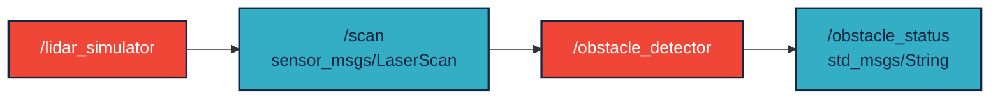
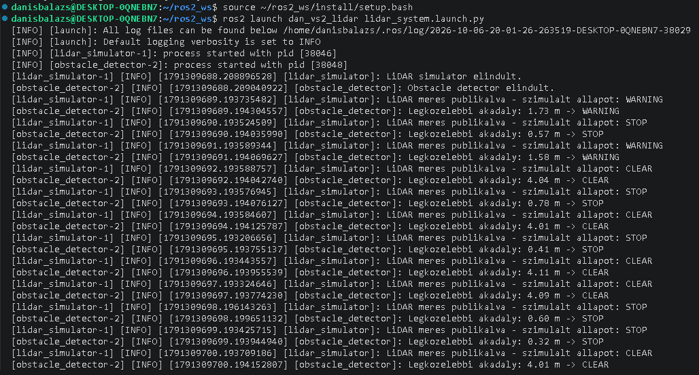
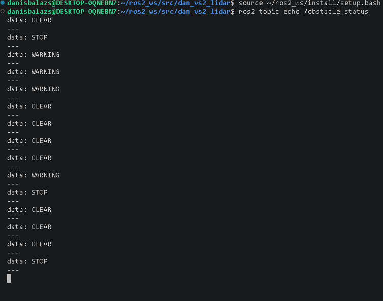

# LiDAR akadályérzékelő

ROS 2 alapú LiDAR akadályérzékelő projekt Python nyelven.

[](https://docs.ros.org/en/humble/)

## Projekt leírása

A projekt célja LiDAR szenzoradatok szimulálása, valamint a robot előtti akadályok érzékelése.

A rendszer két ROS 2 node-ból áll:

- `lidar_simulator` – szimulált LiDAR méréseket publikál a `/scan` topicra `sensor_msgs/LaserScan` üzenettípussal.
- `obstacle_detector` – feliratkozik a `/scan` topicra, megvizsgálja a robot előtti ±30°-os területet, majd meghatározza a legközelebbi akadály távolságát.

Az `obstacle_detector` az eredményt az `/obstacle_status` topicra publikálja `std_msgs/String` üzenettípussal.

Az akadály távolsága alapján három állapot lehetséges:

- `CLEAR` – az akadály legalább 2 méterre található.
- `WARNING` – az akadály 1 és 2 méter között található.
- `STOP` – az akadály 1 méternél közelebb található.

## Használt technológiák

- ROS 2 Humble
- Python
- `rclpy`
- `sensor_msgs/LaserScan`
- `std_msgs/String`

## Node-ok és topicok



## Telepítés

A projekt egy ROS 2 workspace `src` mappájába klónozható:

```bash
cd ~/ros2_ws/src
git clone https://github.com/turorudi666/dan_vs2_lidar.git
```

## Build

A ROS 2 környezet betöltése:

```bash
source /opt/ros/humble/setup.bash
```

A package buildelése:

```bash
cd ~/ros2_ws
colcon build --packages-select dan_vs2_lidar --symlink-install
```

A build után a workspace betöltése:

```bash
source ~/ros2_ws/install/setup.bash
```

## Futtatás

A teljes rendszer egy paranccsal elindítható:

```bash
ros2 launch dan_vs2_lidar lidar_system.launch.py
```

A két node külön-külön is futtatható.

LiDAR szimulátor:

```bash
ros2 run dan_vs2_lidar lidar_simulator
```

Akadályérzékelő:

```bash
ros2 run dan_vs2_lidar obstacle_detector
```

## Eredmény ellenőrzése

Az akadályérzékelő által publikált állapotok megtekinthetők:

```bash
ros2 topic echo /obstacle_status
```

Példa kimenet:

```text
data: CLEAR
---
data: WARNING
---
data: STOP
---
```

A futás közben az `obstacle_detector` a legközelebbi akadály távolságát is kiírja:

```text
Legkozelebbi akadaly: 4.35 m -> CLEAR
Legkozelebbi akadaly: 1.47 m -> WARNING
Legkozelebbi akadaly: 0.62 m -> STOP
```

## Működés

A `lidar_simulator` 360 darab távolságmérést generál, amelyek egy 360°-os LiDAR szenzort szimulálnak.

Az `obstacle_detector` ezek közül csak a robot előtti ±30°-os tartományba eső méréseket vizsgálja. A legkisebb érvényes távolság alapján meghatározza az aktuális akadályállapotot.

## Képek

A két node együttes futása:



Az `/obstacle_status` topic kimenete:

